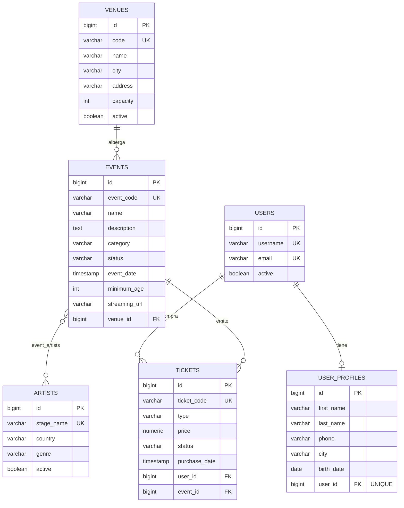

# PulsePass — Capa de persistencia

Caso de estudio académico: capa de persistencia de **PulsePass**, una plataforma de eventos, artistas y entradas. El proyecto cubre únicamente el dominio, la base de datos y las pruebas de integración; no incluye API REST, capa de servicios, autenticación, pagos ni frontend (ver el PRD, secciones 2.4 y 18).

**Integrantes:** Isabella Guerra ([@igguerra](https://github.com/igguerra)) y Valeria Gamez ([@valegzt](https://github.com/valegzt))

## Estructura del proyecto

```
src/
├── main/
│   ├── java/edu/unimag/pulsepass/persistence/
│   │   ├── domain/        Entidades JPA y enums
│   │   └── repository/    Repositories (JpaRepository)
│   └── resources/
│       ├── application.properties
│       └── db/migration/  V1, V2 y V3 (Flyway)
└── test/java/edu/unimag/pulsepass/persistence/
    └── ...                Pruebas de integración con Testcontainers
```

Configuración relevante (`application.properties`):

```properties
spring.jpa.hibernate.ddl-auto=validate
spring.jpa.open-in-view=false
```

Hibernate solo **valida** el esquema; quien lo crea y lo evoluciona es Flyway. La URL, el usuario y la contraseña de la base de datos no se configuran: en las pruebas los inyecta Testcontainers.

## Modelo de dominio



### Relaciones

| Relación | Cardinalidad | Cómo se implementa |
|---|---|---|
| Venue → Event | 1:N | `@ManyToOne(LAZY, optional = false)` en `Event`, con `venue_id NOT NULL` |
| Event ↔ Artist | N:M | `@ManyToMany` con `@JoinTable(name = "event_artists")` en `Event`; PK compuesta `(event_id, artist_id)` |
| User ↔ UserProfile | 1:1 | `@OneToOne` en `UserProfile`; `user_id` con FK y `UNIQUE` |
| User → Ticket | 1:N | `@ManyToOne(LAZY, optional = false)` en `Ticket` |
| Event → Ticket | 1:N | `@ManyToOne(LAZY, optional = false)` en `Ticket` |

### Enums

Todos se guardan **por nombre** con `@Enumerated(EnumType.STRING)` (nunca por ordinal) y además están restringidos con `CHECK` en PostgreSQL.

| Enum | Valores |
|---|---|
| `EventCategory` | MUSIC, SPORTS, TECHNOLOGY, EDUCATION, CULTURE, ENTERTAINMENT |
| `EventStatus` | DRAFT, PUBLISHED, SOLD_OUT, CANCELLED, FINISHED |
| `TicketType` | GENERAL, VIP, BACKSTAGE, STUDENT |
| `TicketStatus` | RESERVED, PAID, CANCELLED, USED |

### Decisiones de diseño

- **Ticket es una entidad, no un `@ManyToMany` entre User y Event**, porque tiene datos propios (`ticketCode`, `type`, `price`, `status`, `purchaseDate`) y porque un usuario puede tener varios tickets para el mismo evento.
- **La relación Event–Artist es unidireccional** (solo `Event` conoce a sus artistas). Así no hay que mantener sincronizados dos lados, y los eventos de un artista se obtienen con una consulta JPQL.
- **`Set` en lugar de `List`** para los artistas de un evento: un `Set` no admite repetidos, coherente con la PK compuesta de `event_artists`.
- **`Artist.equals()` y `hashCode()` usan `stageName`**, que es único, y no el `id`, porque el `id` es `null` hasta que se hace el `INSERT`.
- **Sin `CascadeType`**: los artistas y los usuarios se guardan antes y luego se relacionan.
- **`LAZY` en todas las relaciones `@ManyToOne`**, para no cargar datos que no se necesitan.
- **Precios con `BigDecimal` / `NUMERIC(12,2)`**, nunca `float` ni `double`.
- **Sin Lombok `@Data`** en las entidades: getters y setters escritos a mano.
- **`SOLD_OUT` no se calcula**: es un estado que se asigna manualmente, como indica el MVP.

## Migraciones (Flyway)

| Migración | Qué hace |
|---|---|
| `V1__create_schema.sql` | Crea `venues`, `artists`, `users`, `events`, `event_artists`, `user_profiles` y `tickets`, con PK, FK, UNIQUE, CHECK e índices para las consultas frecuentes (FK de `events`, `event_artists` y `tickets`, y `events(status, event_date)`) |
| `V2__insert_initial_artists.sql` | Inserta el catálogo inicial: Solar Beat, Neon Waves, Caribbean Sound, Ocean Drive y Digital Pulse |
| `V3__add_streaming_url_to_event.sql` | Agrega `streaming_url VARCHAR(500)` (nullable) a `events`, sin modificar V1 |

Una base vacía se reconstruye completa ejecutando las migraciones en orden. **Una migración ya aplicada no se edita**: cualquier cambio estructural nuevo va en una migración nueva (`V4__...`).

## Consultas

Se usan **Query Methods** para filtros simples y navegación de relaciones, y **JPQL con `@Query`** cuando hay JOIN sobre la N:M, `DISTINCT`, `COUNT` o varias asociaciones a la vez. No se usa SQL nativo.

| Repository | Método | Mecanismo | Requisito |
|---|---|---|---|
| `VenueRepository` | `findByCode` | Query Method | FR-VEN-001 |
| `EventRepository` | `findByEventCode` (con `@EntityGraph` para traer el venue) | Query Method | FR-EVT-001 |
| `EventRepository` | `findByStatusOrderByEventDateAsc` | Query Method | FR-EVT-005 |
| `EventRepository` | `findByVenueCode` | Query Method (navega `venue.code`) | FR-VEN-004 |
| `EventRepository` | `findEventsByArtist` | JPQL con JOIN y `DISTINCT` | FR-SRC-001, FR-ART-004 |
| `EventRepository` | `findEventsByCityAndArtist` | JPQL con dos JOIN | FR-SRC-002 |
| `EventRepository` | `findRecommendedEvents` | JPQL con filtros, `DISTINCT`, `LOWER ... LIKE` y orden | FR-SRC-003 |
| `ArtistRepository` | `findByStageName` | Query Method | FR-ART-002 |
| `UserRepository` | `findByEmailIgnoreCase` | Query Method | FR-USR-001 |
| `UserProfileRepository` | `findByUserId` | Query Method | FR-USR-004 |
| `TicketRepository` | `findByUserEmailIgnoreCase` | Query Method (Ticket → User → email) | FR-TKT-006 |
| `TicketRepository` | `findByUserEmailIgnoreCaseAndStatus` | Query Method | FR-TKT-006 |
| `TicketRepository` | `findByEventEventCodeAndStatus` | Query Method | FR-TKT-007 |
| `TicketRepository` | `countPaidTicketsByEventCode` | JPQL con `COUNT` | FR-TKT-008 |
| `TicketRepository` | `findTicketsForUpcomingEvents` | JPQL con orden cronológico | FR-SRC-004 |

**Tickets pagados por evento (FR-TKT-007):** el PRD permite Query Method o JPQL. Se eligió Query Method porque es un filtro de dos condiciones sobre una relación y Spring Data lo resuelve por el nombre; además el método recibe el estado como parámetro, así que sirve para cualquier `TicketStatus`, no solo `PAID`.

## Pruebas

Las pruebas de integración levantan un **PostgreSQL real con Testcontainers** (no se usa H2), dejan que Flyway construya el esquema y luego ejecutan los repositories. Cada prueba usa `@Transactional`, así que los datos se revierten y no se contaminan entre sí. Hay 38 pruebas en total.

### Cómo ejecutarlas

**Requisitos:** JDK 21 y **Docker corriendo** (Docker Desktop abierto en Windows). No hace falta instalar PostgreSQL: Testcontainers descarga y arranca `postgres:17-alpine` por su cuenta. La primera ejecución tarda más porque descarga las dependencias y la imagen.

```bash
# Linux / macOS
./mvnw clean test

# Windows (PowerShell)
.\mvnw.cmd clean test
```

El resultado esperado es `BUILD SUCCESS`. Para ejecutar una sola clase de prueba:

```bash
./mvnw test -Dtest=FlywayMigrationTest
```

Para comprobar solo que el código compila (por ejemplo, en un equipo sin Docker):

```bash
./mvnw test-compile
```

`TestPersistenceApplication` permite además arrancar la aplicación desde el IDE con un PostgreSQL temporal.

### Clases de prueba

| Clase | Qué cubre |
|---|---|
| `FlywayMigrationTest` | V1, V2 y V3 se aplican desde una base vacía; los 5 artistas iniciales; `streaming_url` existe y admite `NULL` |
| `PersistenceApplicationTests` | El contexto de Spring arranca con `ddl-auto=validate` |
| `VenueRepositoryTest` | Persistencia, `code` único y `capacity > 0` |
| `EventRepositoryTest` | Evento con su venue, `eventCode` único, enums guardados por nombre, eventos publicados ordenados, eventos por `venue.code` y `streaming_url` opcional |
| `ArtistRepositoryTest` | Persistencia, `stageName` único, incluido un nombre ya sembrado por V2 |
| `EventArtistTest` | Relación N:M: tres artistas por evento, sin duplicar el par, PK compuesta rechazando duplicados aunque se salte JPA, y un artista en varios eventos |
| `EventSearchTest` | Consultas JPQL de eventos por artista, por ciudad y artista, y recomendados |
| `UserRepositoryTest` | Persistencia, `username` y `email` únicos, búsqueda por email ignorando mayúsculas |
| `UserProfileRepositoryTest` | Datos del perfil recuperables desde el usuario y segundo perfil rechazado (1:1) |
| `TicketRepositoryTest` | FK obligatorias a usuario y evento, `ticketCode` único y precio negativo rechazado |
| `TicketQueryTest` | Tickets por email y estado, tickets pagados por evento, conteo de `PAID` y tickets de eventos futuros |

### Trazabilidad

| Criterio del PRD | Dónde se verifica |
|---|---|
| QT-001 Flyway desde base vacía | `FlywayMigrationTest` |
| QT-002 Hibernate solo valida | `ddl-auto=validate` en todas las pruebas de contexto |
| QT-003 Venue 1:N Event | `EventRepositoryTest` (`retrievesEventWithItsVenue`, `findsEventsByVenueCode`) |
| QT-004 User 1:1 UserProfile | `UserProfileRepositoryTest` |
| QT-005 Event N:M Artist | `EventArtistTest` |
| QT-006 Ticket → User y Event | `TicketRepositoryTest` |
| QT-007 Query Methods | `EventRepositoryTest`, `UserRepositoryTest`, `TicketQueryTest` |
| QT-008 JPQL con JOIN y COUNT | `EventSearchTest`, `TicketQueryTest` |
| QT-009 UNIQUE con `saveAndFlush` | Pruebas `rejectsDuplicate...` de cada repository |
| QT-010 `mvn clean test` en verde | `./mvnw clean test` |

## Preguntas para el equipo (sección 23 del PRD)

**1. ¿Por qué Ticket debe ser una entidad en lugar de un `@ManyToMany` entre User y Event?**
Porque la relación tiene datos propios: `ticketCode`, `type`, `price`, `status` y `purchaseDate`. Un `@ManyToMany` solo genera una tabla de unión con dos FK y no puede guardar esos atributos. Además, un usuario puede tener varios tickets para el mismo evento (por ejemplo, un VIP y uno GENERAL), algo que una tabla de unión con PK compuesta no permitiría, y como entidad el ticket puede tener su propio identificador de negocio único y consultarse por estado.

**2. ¿Qué reglas pertenecen a PostgreSQL y cuáles deberían quedar para una futura capa Service?**
En PostgreSQL van las reglas que deben cumplirse siempre, sin importar quién escriba los datos: unicidad de los identificadores de negocio, claves foráneas, `NOT NULL`, rangos (`capacity > 0`, `price >= 0`), catálogos de enums, la PK compuesta de `event_artists` y el 1:1 de `user_profiles`. En una capa Service irían las reglas de negocio que dependen de varios datos o del flujo: las transiciones de estado válidas (RESERVED → PAID → USED, o CANCELLED), el cálculo automático de `SOLD_OUT` comparando capacidad y tickets pagados, verificar la edad mínima frente al perfil del usuario y no vender tickets de un evento cancelado.

**3. ¿Qué consultas pueden expresarse claramente como Query Methods y cuáles justifican JPQL?**
Son Query Methods los filtros simples y la navegación de relaciones: por `eventCode`, por email ignorando mayúsculas, eventos publicados ordenados por fecha, por `venue.code` y tickets por email y estado. Justifican JPQL las que necesitan JOIN sobre la relación N:M, `DISTINCT`, agregaciones o varias condiciones sobre distintas asociaciones: eventos por artista, por ciudad y artista, los recomendados, el conteo de tickets pagados y los tickets de eventos futuros. Un nombre de método para esos casos sería ilegible.

**4. ¿Qué consecuencias tendría modificar V1 después de haberla aplicado en un ambiente compartido?**
Flyway guarda el checksum de cada migración en `flyway_schema_history`. Si se edita V1 después de aplicada, la validación falla en cada ambiente donde ya corrió (`Migration checksum mismatch`) y la aplicación no arranca. Además, los ambientes quedarían con esquemas distintos: los nuevos con la versión editada y los antiguos con la original. La forma correcta es dejar V1 intacta y agregar una migración nueva (`V4__...`). En las pruebas con Testcontainers este problema no se nota, porque la base se crea desde cero en cada ejecución.

**5. ¿Qué diferencias podría ocultar una prueba con H2 frente a PostgreSQL?**
H2 tiene otro dialecto y otro comportamiento: puede aceptar SQL, tipos o funciones que PostgreSQL rechaza (y al revés), tratar de forma distinta los `CHECK`, las columnas de identidad, el manejo de mayúsculas en identificadores, la precisión de `NUMERIC` y las comparaciones con `LIKE`. Las migraciones escritas para PostgreSQL podrían incluso no ejecutarse en H2. Una prueba en verde con H2 no garantiza que el esquema y las consultas funcionen en el motor real, por eso se usa PostgreSQL con Testcontainers.

**6. ¿Cómo evolucionaría el modelo para soportar inventario de tickets y evitar sobreventa?**
Se añadiría una tabla de inventario por evento y tipo de ticket (por ejemplo, `ticket_inventory` con `event_id`, `type`, `total_quantity` y `sold_quantity`), con un `CHECK` que impida que lo vendido supere el total. La venta se haría en una transacción de la capa Service que reserve el cupo con un `UPDATE ... WHERE available > 0` atómico, o con bloqueo optimista (`@Version`) o pesimista (`SELECT ... FOR UPDATE`) para evitar condiciones de carrera entre compradores simultáneos. También convendría que las reservas (`RESERVED`) expiren si no se pagan, y calcular `SOLD_OUT` a partir del inventario.

## Flujo de trabajo del equipo

El trabajo se dividió por bloques, cada uno en su propia rama y con Pull Request revisado por la otra persona antes de integrarse a `main`:

| Rama | Contenido |
|---|---|
| `main` (inicial) | Esqueleto, migraciones V1–V3, `Venue` y `Event` |
| `feature/artist` | `Artist`, relación N:M con `Event` y consultas JPQL de búsqueda |
| `feature/user-profile` | `User`, `UserProfile` y su relación 1:1 |
| `feature/ticket` | `Ticket`, sus enums, `TicketRepository` y consultas |

Los mensajes de commit y las pruebas hacen referencia a los identificadores de requisito del PRD (por ejemplo, `FR-TKT-003`) cuando corresponde.
